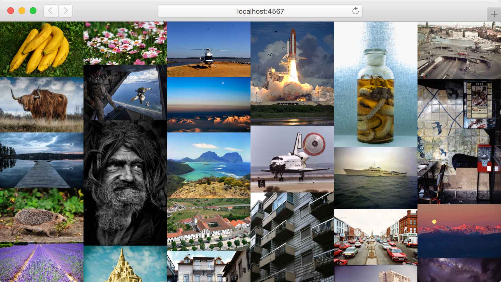

# woid

A crude hack to show a Wall Of Images (from a) Directory.

## How to get up and running

You will need `ruby` and `bundler` installed. Then you can run:

    bundle install
    ruby app.rb

Remember to add some images for display in the `public/images` directory.
